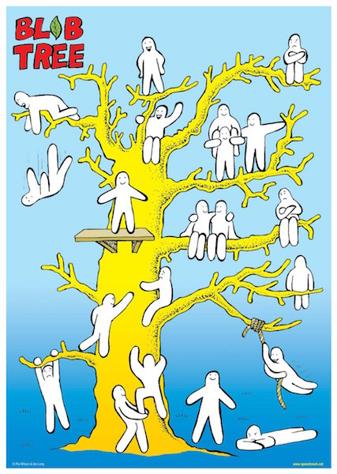
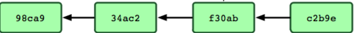
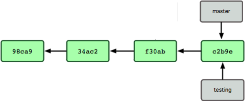
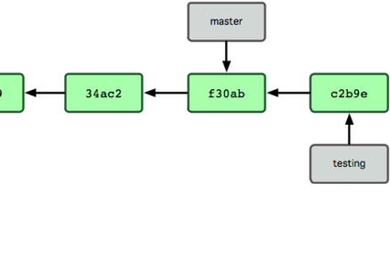
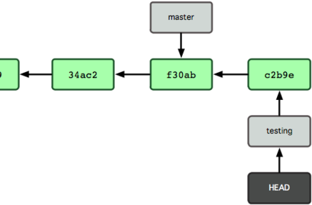
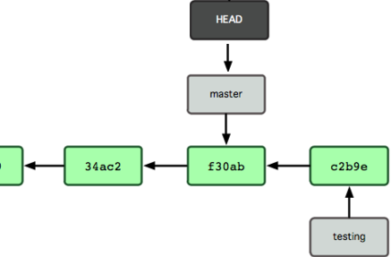

class: center, middle

# Let's talk about Git early in the morning on the old "HUMP DAYlol"

---

class: center, middle

## Things we'll talk about

commits  
trees  
blobs  
branches

???
some of this sounds familiar, some not so much.

---

class: center, middle

## Things we won't talk about

SHA1  
tags

???
- SHA1 - secure hashing algorithm - how all the stuff in git is named. disregard for today, just know we're calling these 'hashes'
- tags - the final git object that we won't discuss :)
---

class: center, middle

# Make a thing

(now Vinney does things)

???
- git init
- create readme (echo 'hello world' > readme.md)
- git add readme
- git log - this is boring
- git-generate-history 2 example-file rb
- go to next slide!

---

# `git-generate-history`

This is cool, but it's a tangent. Don't pay attention to this.

**It's just generating some random files and commiting them to make some history.**

I'll post it in Slack later...

???
- tell them to read the above while you do stuff
- now run: git log - now there's some stuff there

---

# Plumbing and Porcelain

## `git cat-file`

> ...the command provides the **content** or the type of an object in the repository.

???
- usually we interact with the 'porcelain'
- but git is built from 'plumbing' - we're going to PLUMB THE DEPTHS (yes, this is in my notes)
- git --help cat-file

---

class: center, middle


(sorry, Perri. it wouldn't be a dev presentation without a cat picture)

???
- let's cat some files.
- git log - now there's some stuff there
- git cat-file -t the last commit: this is a 'commit' (our first type)
- git cat-file -p the last commit: here are all the details for the commit.
- next slide

---

# The `commit` type

## What do we have in here?

```bash
tree a29e752668629a4168c36de78b42b02761a3645d
parent 456fb3323b753c175e14dd375acb621dd83a1911
author vinney cavallo <vcavallo@gmail.com>
committer vinney cavallo <vcavallo@gmail.com>

Some commit message here
```

- commit message at the bottom
- `tree`
- `parent`
- some author and committer stuff

???
- commit message. very familiar.
- show git-log to corroborate
- author, commiter. normal stuff
- parent. interesting.. sounds maybe familiar for git commits?
- tree... ok that sound weird. what's that?
- next slide

---

class: center, middle

# /r/trees

???
- tree? git cat-file -t the tree: this is a 'tree' (our second type)
- git ls-tree the tree: same thing
- what's this tree thing? we'll think of this as a snapshot of the filesystem at that commit.

---

# The `tree` type

```bash
100644 blob a990320888326d9c9b520120cec6adba53853604    example-file1.rb
100644 blob ceb25638937994e9c5e3b3af491b6cd32b8feb99    example-file2.rb
100644 blob df87c5276acaa8fb585a5f13d2ef8facb224719c    readme.md
```

- can include **blobs** (up next)
- can include other **trees** (like inner folders)

???
- ls-tree works on tree hashes - folder-like.

---

class: center, middle

# Blobs in trees



???
- (you can tell what i google image searched for this)
- what are these blobs?
- git cat-file -t readme.md: this is a 'blob' (our third type)
- git cat-file -p readme.md: hey whatdya know. the content.

---


# the `blob` type

- a collection of bytes that could be any kind of file.
- pretty simple. essentially `blob == file`.
- we can't simply `cat` it because it's compressed. `cat-file` helps us with that.

???
- just think of this as a file. blob == file
- we quickly discussed trees and the blobs in them.
- think about the commit contents agian, wasn't there't something else?

---

class: center, middle

# Wasn't there something else in that `commit` type...?


???
- this is the first thing i thought of for "parent".... weird?
- terminal
- git cat-file the last commit again
- what's this parent thing?
- git cat-file -t the parent hash: hey, it's a commit. that's already one of our things.
- git log: what's before the last commit? note the message.
- git cat-file -p the parent hash: it's that previous commit. this is the linkage in the history.

---

class: center, middle



???
- you know how you've seen this thing a million times for git? well that's how it works.
- each of those is a commit sha and their 'parent' is the one to the left

---

# Maybe I knew that stuff.  
# Isn't there more to this?

# What _ARE_ all these things?

...Well, they're just, like, **files**, man.

(what else could they be?)

???
- go into the filesystem: tree .git. notice all the .git/objects.
- let's see if we can notice anything useful about this mess...
- git log
- notice that the commit hash is the folder/file pair
- file .git/objects/1a/fjk324kl23j423.... == the commit / blob / tree
- when we're doing `cat-file` that nice little bit of plumbing is printing that ^ for us
- also show that the tree is in here.
- also show that the blobs are in here.
- in here: trees, blobs, commits. our three objects.
- SKIP:: git cat-file -p $(git rev-list master -1) --- dissect this
- SKIP:: git cat-file -p our last commit... notice that the commit hash is a folder/file pair

---

# It's all just files

## `.git/objects/*`

- home to all our object types:
    - commits
    - blobs
    - trees

???
review

---

class: center

# Wait, doesn't git do this other thing...?

--


???
- here's a hint...

--

## squirrelling!

---

class: center

# Wait, doesn't git do this other thing...?


## ~~squirrelling!~~

## _BRANCHING_

---

class: center


???
- where are the branches in this objects folder....? tree .git/{objects,refs}
- what's this heads directory? i see 'master' in here, that sounds familiar...
- checkout a new branch
- ls .git/refs/heads
- cat .git/refs/heads/hello-im-a-branch
- does this look familiar...? it's the last commit.
- so we see a 'branch' is really just a teeny text file with a commit as its contents
- ls -lh .git/refs/heads/master -- get filesize
- advance.

--

## This is why branches are so cheap

---

# The `branch`

- just a plain file with a pointer to a commit!

---

class: center

# Branches, still


???
- hey what about the master branch? cat .git/refs/heads/master
- same thing.... ah - our branches haven't diverged at all.
- advance, show updated picture

---

class: center

# Branches, still



???
- same thing.... ah - our branches haven't diverged at all.
- make sure you're on new branch
- generate a new file.

---

class: center

# Branches, still



???
- cat the new branch ref again - it's the newest commit.

---

class: center

# Branches, still



???
- there's one final piece. what's HEAD? how does that work?
- well it's all just a filesystem, let's look for it....
- ls -lh .git ---> what's this HEAD thing.... maybe we cat it?
- hey, it's got some record of a ref in it - which we know are essentially
  containers for a commit now.
- mention DETACHAED HEAD
- peep this ref
- checkout master....
- advance for picture

---

class: center

# Branches, still



???
- cat .git/HEAD again. no surprise here...

---

# One last topic

## `git reflog`

```bash
(master) $ git reflog master
ca7917d master@{0}: reset: moving to ca7917d
ffc7a47 master@{1}: reset: moving to ffc7a47
ca7917d master@{2}: commit: Add extra credit slides
8f020ad master@{3}: commit: Add all but conclusion slide
ffc7a47 master@{4}: commit: Add slides up to blob
0c949fb master@{5}: commit: Start adding slides
456fb33 master@{6}: commit: Finalize demo notes
dc2a5ac master@{7}: commit: Add nearly all the demo steps
f2b2617 master@{8}: commit: Start to fill out skeleton of notes
3ec962d master@{9}: commit (initial): Add notes file
```

- time machine
- local-only
- pruned after a few months

???
- retrace your steps
- If you `rm -rf` your project and re-clone, you'll lose this. might be useful on large projects
- look at this on a big project, it's really interesting

---

# Extra Credit - Tags

- point to a particular commit / tree
- good historical record
- easier to use than the hash for the tree/commit
- good for versioning for this reason

???
- I said I wouldn't talk about this
- point to a particular commit - which we remember is a snapshot, right?
- version: permament pointer to a given point in time, includes messages

---

# Extra Credit - How the blob is formed

- compressed with zlib (https://en.wikipedia.org/wiki/Zlib)
- ...that's about it.

???
- git log, get a commit hash
- ls .git/objects/xx/xxxxx <-- copy that!
- $python
- import zlib # import the compression library
- file = open("paste.....", "rb") # open that file
- data = file.read() # read it into a variable
- print data # binary nonsense
- zlib.decompress(data) # decompress it with zlib
- notice the difference: [TYPE] [original size] [a null byte] [contents]
- vs: contents only (do git cat-file again side-by-side)

---

class: middle

# Summary

- `commits`, `blobs`, `trees`: the building blocks.
- all super-simple files, organized non-myteriously in `.git` hidden folder
- compressed and hashed, but git's plumbing helps make irrelevant
- `branch`: even simpler. just a pointer to a commit hash
- `HEAD`: more of the same. simple file with a ref inside

???

---

