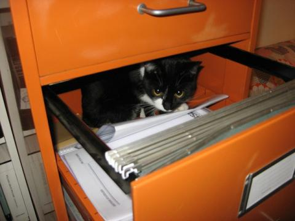

class: center, middle

# Let's talk about Git early in the morning on the old "HUMP DAYlol"

---

class: center, middle

## Things we'll talk about

commits  
trees  
blobs  
branches

???
some of this sounds familiar, some not so much.

---

class: center, middle

## Things we won't talk about

SHA1  
tags

???
- SHA1 - secure hashing algorithm - how all the stuff in git is named. disregard for today, just know we're calling these 'hashes'
- tags - the final git object that we won't discuss :)
---

class: center, middle

# Make a thing

(now Vinney does things)

???
- git init
- create readme (echo 'hello world' > readme.md)
- git add readme
- git log - this is boring
- git-generate-history 2 example-file rb
- go to next slide!

---

# `git-generate-history`

This is cool, but it's a tangent. Don't pay attention to this.

**It's just generating some random files and commiting them to make some history.**

I'll post it in Slack later...

???
- tell them to read the above while you do stuff
- now run: git log - now there's some stuff there

---

# Plumbing and Porcelain

## `git cat-file`

> ...the command provides the **content** or the type of an object in the repository.

???
- usually we interact with the 'porcelain'
- but git is built from 'plumbing' - we're going to PLUMB THE DEPTHS (yes, this is in my notes)
- git --help cat-file

---

class: center, middle



(sorry, Perri. it wouldn't be a dev presentation without a cat picture)

???
- let's cat some files.
- git log - now there's some stuff there
- git cat-file -t the last commit: this is a 'commit' (our first type)
- git cat-file -p the last commit: here are all the details for the commit.
- next slide

---

# The `commit` type

## What do we have in here?

```bash
tree a29e752668629a4168c36de78b42b02761a3645d
parent 456fb3323b753c175e14dd375acb621dd83a1911
author vinney cavallo <vcavallo@gmail.com>
committer vinney cavallo <vcavallo@gmail.com>

Some commit message here
```

- commit message at the bottom
- `tree`
- `parent`
- some author and committer stuff

???
- commit message. very familiar.
- show git-log to corroborate
- author, commiter. normal stuff
- parent. interesting.. sounds maybe familiar for git commits?
- tree... ok that sound weird. what's that?
- next slide

---

class: center, middle

# /r/trees

???
- tree? git cat-file -t the tree: this is a 'tree' (our second type)
- git ls-tree the tree: same thing
- what's this tree thing? we'll think of this as a snapshot of the filesystem at that commit.

---

# The `tree` type

```bash
100644 blob a990320888326d9c9b520120cec6adba53853604    example-file1.rb
100644 blob ceb25638937994e9c5e3b3af491b6cd32b8feb99    example-file2.rb
100644 blob df87c5276acaa8fb585a5f13d2ef8facb224719c    readme.md
```

- can include **blobs** (up next)
- can include other **trees** (like inner folders)

???
- ls-tree works on tree hashes - folder-like.

---

class: center, middle

# Blobs in trees


???
- (you can tell what i google image searched for this)
- what are these blobs?
- git cat-file -t readme.md: this is a 'blob' (our third type)
- git cat-file -p readme.md: hey whatdya know. the content.

---


# the `blob` type

- a collection of bytes that could be any kind of file.
- pretty simple. essentially `blob == file`.
- we can't simply `cat` it because it's compressed. `cat-file` helps us with that.

???
- just think of this as a file. blob == file

---

class: center, middle

# Wasn't there something else in that `commit` type...?


???
- this is the first thing i thought of for "parent".... weird?
- terminal
- git cat-file the last commit again
- what's this parent thing?
- git cat-file -t the parent hash: hey, it's a commit. that's already one of our things.
- git log: what's before the last commit? note the message.
- git cat-file -p the parent hash: it's that previous commit. this is the linkage in the history.

---

class: center, middle


???
you know how you've seen this thing a million times for git? well that's how it works.

---
